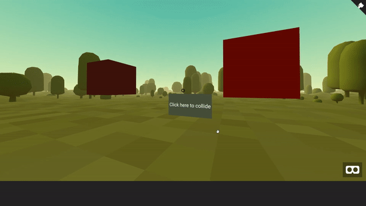

## aframe-pardo-collider-component

[](https://npmjs.org/package/aframe-pardo-collider-component)
[](https://npmjs.org/package/aframe-pardo-collider-component)



A simple collider for detecting when two objects interact with each other

For [A-Frame](https://aframe.io).

### API

| Property | Description | Default Value |
| -------- | ----------- | ------------- |
|    sa      |             |               |

### Installation

#### Browser

Install and use by directly including the [browser files](dist):

```html
<head>
  <title>My A-Frame Scene</title>
  <script src="https://aframe.io/releases/0.7.0/aframe.min.js"></script>
  <script src="https://unpkg.com/aframe-pardo-collider-component/dist/aframe-pardo-collider-component.min.js"></script>
</head>

<body>
  <a-scene>
    <a-entity aframe-pardo-collider-component="foo: bar"></a-entity>
  </a-scene>
</body>
```
### Requirement
For this to work, the object that you assign this to **must have** an object 3D property. This means that  assigning it to an `<a-entity>` will not work.


#### npm

Install via npm:

```bash
npm install aframe-pardo-collider-component
```

Then require and use.

```js
require('aframe');
require('aframe-pardo-collider-component');

// You must instantiate the Collider:
new ColliderComponent();

```
